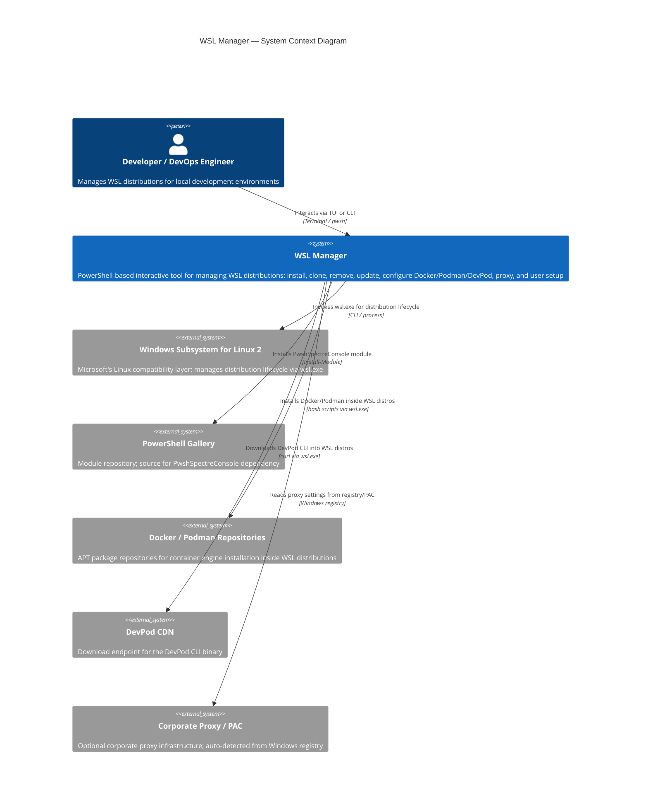
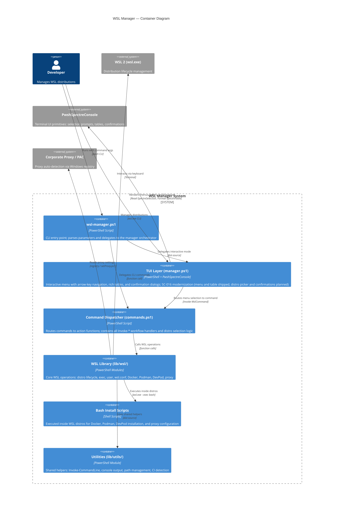

[← Back to Docs](../wsl-manager.md)

# WSL Manager — C4 Architecture (SC-016)

This document describes the planned architecture for the WSL Manager with the modernized PwshSpectreConsole TUI, following the [C4 model](https://c4model.com/) at three levels: Context, Container, and Component.

All diagrams use [Mermaid.js](https://mermaid.js.org/) C4 syntax.

---

## Level 1 — System Context

Shows the WSL Manager system in relation to its users and the external systems it interacts with.

---

## Level 2 — Container Diagram

Zooms into the WSL Manager system, showing its internal containers (executable units / deployable modules) and how they collaborate.

---

## Level 3 — Component Diagram

Zooms into the WSL Library container, showing the individual PowerShell modules and their responsibilities.

```mermaid
C4Component
    title WSL Manager — Component Diagram (WSL Library)

    Container_Boundary(tuiContainer, "TUI Layer") {
        Component(showMenu, "Show-WslMenu", "Shipped SC-016b", "Arrow-key menu using Read-SpectreSelection; replaces Read-Host letter input")
        Component(showTable, "Show-WslDistroTable", "Shipped SC-016c", "Rich distro table using Format-SpectreTable with colored status columns")
        Component(selectDistro, "Select-WslDistro", "Planned SC-016d", "Distro picker using Read-SpectreSelection; replaces numbered Read-Host input")
        Component(confirmAction, "Confirm-DestructiveAction", "Planned SC-016e", "Read-SpectreConfirm for remove, terminate, shutdown operations")
    }

    Container_Boundary(dispatcherContainer, "Command Dispatcher (commands.ps1)") {
        Component(invokeWslCmd, "Invoke-WslCommand", "PowerShell", "Central dispatch: routes command string to the matching Invoke-* handler")
        Component(invokeCreate, "Invoke-CreateDistro", "PowerShell", "Install workflow: lists available distros, prompts for selection, calls New-WslDistro")
        Component(invokeClone, "Invoke-CloneDistro", "PowerShell", "Clone workflow: select source distro, prompt target name, calls Copy-WslDistro")
        Component(invokeRemove, "Invoke-RemoveDistro", "PowerShell", "Remove workflow: select distro, calls Remove-WslDistro")
        Component(invokeSetup, "Invoke-Setup* Handlers", "PowerShell", "Setup workflows: User, Docker, Podman, DevPod, Proxy — each delegates to lib functions")
        Component(invokeOps, "Invoke-TerminateDistro / Invoke-ShutdownWsl", "PowerShell", "Operational commands: stop single distro or shutdown entire WSL subsystem")
    }

    Container_Boundary(wslLibContainer, "WSL Library (lib/wsl/)") {
        Component(core, "core.ps1", "PowerShell", "WSL status checks: Test-WslInstalled, Assert-Wsl2Installed, Get-WslDistroList, Get-WslDistroState, Get-WslDistroType, Stop-WslDistro")
        Component(install, "install.ps1", "PowerShell", "Distribution provisioning: Get-WslAvailableDistro, New-WslDistro")
        Component(ops, "ops.ps1", "PowerShell", "Distribution operations: Remove-WslDistro, Copy-WslDistro, Update-WslDistro, Stop-WslSubsystem, Merge-WslConfig, Invoke-ConfigureWsl")
        Component(exec, "exec.ps1", "PowerShell", "Command execution bridge: Invoke-WslDistroCommand, Invoke-WslDistroScript — runs bash inside WSL distros")
        Component(wslConf, "wsl-conf.ps1", "PowerShell", "Per-distro configuration: Set-WslConf, Test-WslSystemdConfigured, Test-WslInteropConfigured, Test-WslAutomountConfigured")
        Component(userMgmt, "user.ps1", "PowerShell", "User management: New-WslUser, Get-WslDefaultUser")
        Component(docker, "docker.ps1", "PowerShell", "Docker Engine lifecycle: Test-WslDockerInstalled, Install-WslDockerEngine")
        Component(podman, "podman.ps1", "PowerShell", "Rootless Podman lifecycle: Test-WslPodmanInstalled, Install-WslPodman")
        Component(devpod, "devpod.ps1", "PowerShell", "DevPod CLI lifecycle: Test-WslDevPodInstalled, Install-WslDevPod")
        Component(proxy, "proxy.ps1", "PowerShell", "Proxy configuration: Install-WslProxy auto-detects PAC/registry/px, configures profile.d + zshenv env, apt, Docker, Podman")
    }

    Container_Boundary(scriptContainer, "Bash Install Scripts (lib/wsl/scripts/)") {
        Component(dockerSh, "install-docker.sh", "Bash", "Installs Docker CE, Docker Compose; configures binfmt.d; adds user to docker group")
        Component(podmanSh, "install-podman.sh", "Bash", "Installs Podman rootless; configures subuid/subgid and registries")
        Component(devpodSh, "install-devpod.sh", "Bash", "Downloads DevPod CLI binary; configures container provider (docker/podman)")
        Component(proxySh, "setup-proxy.sh", "Bash", "Writes proxy env vars to /etc/profile.d (sourced from zshenv), apt.conf, Docker config, Podman config")
    }

    Rel(showMenu, invokeWslCmd, "Selected command")
    Rel(showTable, core, "Get-WslDistroList -Detailed")
    Rel(selectDistro, core, "Get-WslDistroList -Detailed")
    Rel(confirmAction, invokeOps, "Confirmed destructive action")

    Rel(invokeWslCmd, invokeCreate, "install")
    Rel(invokeWslCmd, invokeClone, "clone")
    Rel(invokeWslCmd, invokeRemove, "remove")
    Rel(invokeWslCmd, invokeSetup, "setup-*")
    Rel(invokeWslCmd, invokeOps, "terminate / shutdown")

    Rel(invokeCreate, install, "New-WslDistro")
    Rel(invokeClone, ops, "Copy-WslDistro")
    Rel(invokeRemove, ops, "Remove-WslDistro")
    Rel(invokeSetup, docker, "Install-WslDockerEngine")
    Rel(invokeSetup, podman, "Install-WslPodman")
    Rel(invokeSetup, devpod, "Install-WslDevPod")
    Rel(invokeSetup, proxy, "Install-WslProxy")
    Rel(invokeSetup, userMgmt, "New-WslUser")
    Rel(invokeOps, core, "Stop-WslDistro")
    Rel(invokeOps, ops, "Stop-WslSubsystem")

    Rel(docker, exec, "Invoke-WslDistroScript")
    Rel(docker, wslConf, "Set-WslConf, Test-*Configured")
    Rel(podman, exec, "Invoke-WslDistroScript")
    Rel(podman, wslConf, "Set-WslConf, Test-*Configured")
    Rel(devpod, exec, "Invoke-WslDistroScript")
    Rel(proxy, exec, "Invoke-WslDistroScript")
    Rel(userMgmt, exec, "Invoke-WslDistroCommand")
    Rel(userMgmt, wslConf, "Set-WslConf")

    Rel(exec, dockerSh, "install-docker.sh")
    Rel(exec, podmanSh, "install-podman.sh")
    Rel(exec, devpodSh, "install-devpod.sh")
    Rel(exec, proxySh, "setup-proxy.sh")

    UpdateLayoutConfig($c4ShapeInRow="4", $c4BoundaryInRow="1")
```

---

## SC-016 Change Impact Summary

The following table maps the SC-016 changes to the affected components and their current status:

| SC-016 Change | Current Implementation | Planned Implementation | Affected Components | Status |
|---|---|---|---|---|
| Menu selection | `Read-Host` letter input | `Read-SpectreSelection` arrow-key navigation | `manager.ps1` → `Show-WslMenu` (new) | Done (SC-016b) |
| Distro table | `Write-Host` with basic colors | `Format-SpectreTable` with borders and colored status | `commands.ps1` → `Show-WslDistroTable` (new) | Done (SC-016c) |
| Distro picker | `Read-Host` numbered input | `Read-SpectreSelection` for distro lists | `commands.ps1` → `Select-WslDistro` (modified) | Open (SC-016d) |
| Destructive confirmations | Implicit (no confirmation in TUI) | `Read-SpectreConfirm` for remove, terminate, shutdown | `commands.ps1` → `Confirm-DestructiveAction` (new) | Open (SC-016e) |
| Status coloring | `Write-Host -ForegroundColor` | Spectre markup: `[green]Running[/]`, `[red]Stopped[/]` | `Show-WslDistroTable` | Done (SC-016c) |
| Module dependency | None | `PwshSpectreConsole` v2 from PSGallery | Setup process / `Install-Module` | Done (SC-016a) |

### Key architectural principle

> Only the **TUI layer** changes. The `commands.ps1` action functions (`Invoke-*`) and the entire `lib/wsl/` library remain structurally unchanged.

[← Back to Docs](../wsl-manager.md)
